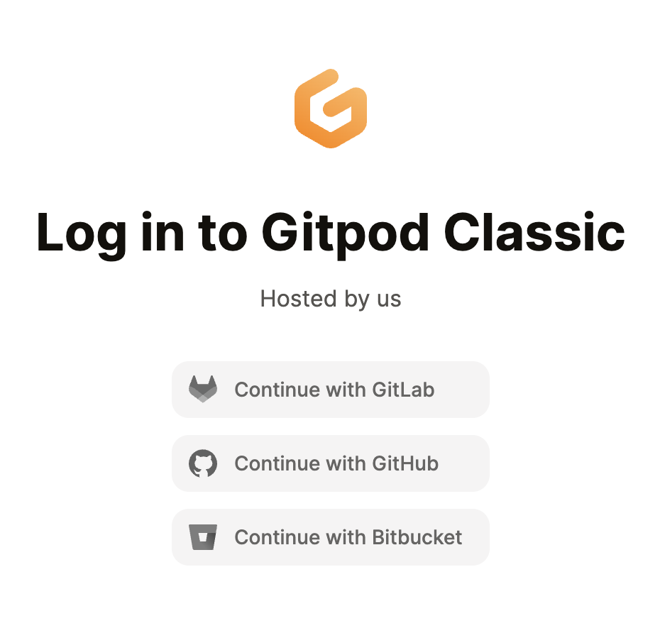
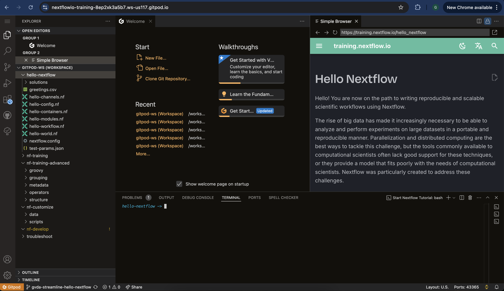

# Gitpod

Gitpod is a cloud-based development environment for teams to efficiently and securely develop software.
We use it to provide a consistent training environment for everyone.

## Creating a Gitpod account

You can create a free [Gitpod](https://gitpod.io/) account from the [Gitpod login page](https://gitpod.io/login/).

You will be prompted to choose between 'Gitpod Flex' and 'Gitpod Classic'.
Select 'Gitpod Classic' and click 'Continue'.

Next, log in using your GitHub account.

You may need to fill out an additional form or two.
When prompted to connect a LinkedIn account, we recommend doing so if you have one, to receive the extra 50 hours usage allocation.
Don't worry too much if you don't have one; the basic allocation is more than enough to work through the introductory training course.

If you are prompted to select your preferred editor, we strongly recommend choosing the VSCode editor, as that is what we use for Nextflow development in general and for trainings in particular.

## Running Gitpod

Once you are logged in to Gitpod, open this link in your browser to open the training environment: <https://gitpod.io/#https://github.com/nextflow-io/training>

This URL is the address to the Nextflow training repository prefixed with `https://gitpod.io/#`.

Alternatively, you can click on the button shown below from the many pages in the training portal where it is displayed.

If you are already logged in, your Gitpod environment will start to load.

### Explore your Gitpod IDE

After Gitpod has loaded, you should see something similar to the following (which may in light mode depending on your account preferences):

This is the interface of the VSCode IDE, a popular code development application that we recommend using for Nextflow development.

- **The sidebar** allows you to customize your Gitpod environment and perform basic tasks (copy, paste, open files, search, git, etc.). You can click the explorer button to see which files are in this repository.
- **The terminal** allows you to run all the programs in the repository. For example, both `nextflow` and `docker` are installed and can be executed.
- **The file explorer** allows you to view and edit files. Clicking on a file in the explorer will open it within the main window.
- **The Simple Browser** lets you view the training instructions in a web browser (<https://training.nextflow.io/>). If you close it by accident, you can load the simple browser again by typing the following in the terminal: `gp preview https://training.nextflow.io`.

### Gitpod resources

Gitpod gives you up to 500 free credits per month, which is equivalent to 50 hours of free environment runtime using the standard workspace (up to 4 cores, 8 GB RAM, and 30 GB storage).

There is also a large workspace option that gives you up to 8 cores, 16GB RAM, and 50GB storage. However, the large workspace will use your free credits quicker and you will have fewer hours of access to this space.

Gitpod will time out after 30 minutes of inactivity and will save your changes for up to 2 weeks.

More information about Gitpod is available at [gitpod.io](https://www.gitpod.io).

### Reopening a Gitpod session

You can reopen an environment from <https://gitpod.io/workspaces>. Previous environments will be listed. You can select the ellipsis (three dots icon) and then select `Open` to reopen a previous environment.

If you have saved the URL for your previous Gitpod environment, you can simply open it in your browser.

Alternatively, you can open a new training workspace by following the Gitpod URL: <https://gitpod.io/#https://github.com/nextflow-io/training>

### Saving files from Gitpod to your local machine

To save any file from the explorer panel, right-click the file and select `Download`.
